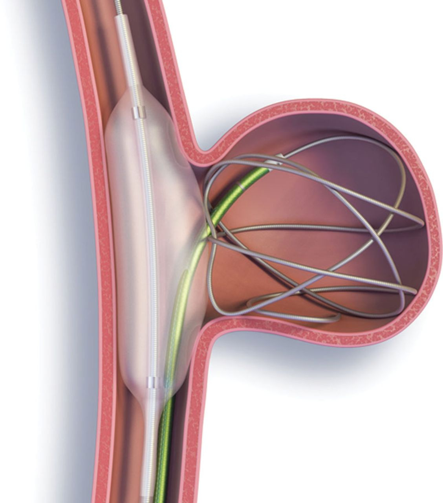

# Modelling Fluid Flow through Porous Media

This was a 4th year research project that I undertook at Durham University as part of the MMath Mathematics degree.

The objective of this project was to study the flow of a fluid through porous media by adapting the Navier-Stokes equations using the volume-averaging method, and implementing this computationally using the lattice Boltzmann method. This was then used as a basis to simulate a two-dimensional blood flow through an aneurysm that is treated with a coil.

  

